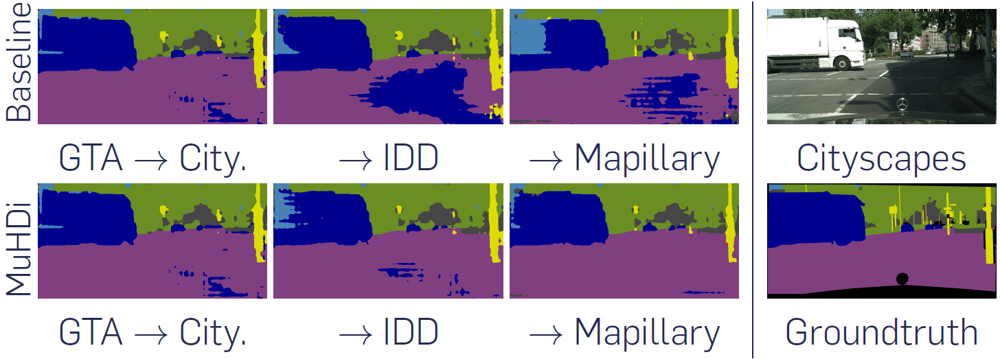

# Multi-Head Distillation for Continual Unsupervised Domain Adaptation in Semantic Segmentation

## Paper


[Multi-Head Distillation for Continual Unsupervised Domain Adaptation in Semantic Segmentation](https://arxiv.org/abs/2204.11667)  
 [Antoine Saporta](https://www.linkedin.com/in/antoine-saporta-08a503227/), [Arthur Douillard](https://arthurdouillard.com), [Tuan-Hung Vu](https://tuanhungvu.github.io/), [Patrick Pérez](https://ptrckprz.github.io/), [Matthieu Cord](http://webia.lip6.fr/~cord/)    
 IEEE/CVF Conference on Computer Vision and Pattern Recognition (CVPR) 2022 Workshop on Continual Learning

If you find this code useful for your research, please cite our [paper](https://arxiv.org/abs/2204.11667):

```
@inproceedings{saporta2022muhdi,
  title={Multi-Head Distillation for Continual Unsupervised Domain Adaptation in Semantic Segmentation},
  author={Saporta, Antoine and Douillard, Arthur and Vu, Tuan-Hung and P{\'e}rez, Patrick and Cord, Matthieu},
  booktitle={Proceedings of the IEEE/CVF Conference on Computer Vision and Pattern Recognition (CVPR) Workshop},
  year={2022}
}
```

## Abstract
Unsupervised Domain Adaptation (UDA) is a transfer learning task which aims at training on an unlabeled target domain by leveraging a labeled source domain. Beyond the traditional scope of UDA with a single source domain and a single target domain, real-world perception systems face a variety of scenarios to handle, from varying lighting conditions to many cities around the world. In this context, UDAs with several domains increase the challenges with the addition of distribution shifts within the different target domains. This work focuses on a novel framework for learning UDA, continuous UDA, in which models operate on multiple target domains discovered sequentially, without access to previous target domains. We propose MuHDi, for Multi-Head Distillation, a method that solves the catastrophic forgetting problem, inherent in continual learning tasks. MuHDi performs distillation at multiple levels from the previous model as well as an auxiliary target-specialist segmentation head. We report both extensive ablation and experiments on challenging multi-target UDA semantic segmentation benchmarks to validate the proposed learning scheme and architecture.

## Preparation

### Pre-requisites
* Python 3.7
* Pytorch >= 0.4.1
* CUDA 9.0 or higher

### Installation
0. Clone the repo:
```bash
$ git clone https://github.com/valeoai/MuHDi
$ cd MuHDi
```

1. Install OpenCV if you don't already have it:

```bash
$ conda install -c menpo opencv
```

2. Install this repository and the dependencies using pip:
```bash
$ pip install -e <root_dir>
```

With this, you can edit the MuHDi code on the fly and import function
and classes of MuHDi in other project as well.

3. Optional. To uninstall this package, run:
```bash
$ pip uninstall MuHDi
```

### Datasets
By default, the datasets are put in ```<root_dir>/data```. We use symlinks to hook the MuHDi codebase to the datasets. An alternative option is to explicitly specify the parameters ```DATA_DIRECTORY_SOURCE``` and ```DATA_DIRECTORY_TARGET``` in YML configuration files.

* **GTA5**: Please follow the instructions [here](https://download.visinf.tu-darmstadt.de/data/from_games/) to download images and semantic segmentation annotations. The GTA5 dataset directory should have this basic structure:
```bash
<root_dir>/data/GTA5/                               % GTA dataset root
<root_dir>/data/GTA5/images/                        % GTA images
<root_dir>/data/GTA5/labels/                        % Semantic segmentation labels
...
```

* **Cityscapes**: Please follow the instructions in [Cityscape](https://www.cityscapes-dataset.com/) to download the images and ground-truths. The Cityscapes dataset directory should have this basic structure:
```bash
<root_dir>/data/cityscapes/                         % Cityscapes dataset root
<root_dir>/data/cityscapes/leftImg8bit              % Cityscapes images
<root_dir>/data/cityscapes/leftImg8bit/train
<root_dir>/data/cityscapes/leftImg8bit/val
<root_dir>/data/cityscapes/gtFine                   % Semantic segmentation labels
<root_dir>/data/cityscapes/gtFine/train
<root_dir>/data/cityscapes/gtFine/val
...
```

* **Mapillary**: Please follow the instructions in [Mapillary Vistas](https://www.mapillary.com/dataset/vistas) to download the images and validation ground-truths. The Mapillary Vistas dataset directory should have this basic structure:
```bash
<root_dir>/data/mapillary/                          % Mapillary dataset root
<root_dir>/data/mapillary/train                     % Mapillary train set
<root_dir>/data/mapillary/train/images
<root_dir>/data/mapillary/validation                % Mapillary validation set
<root_dir>/data/mapillary/validation/images
<root_dir>/data/mapillary/validation/labels
...
```

* **IDD**: Please follow the instructions in [IDD](https://idd.insaan.iiit.ac.in/) to download the images and validation ground-truths. The IDD Segmentation dataset directory should have this basic structure:
```bash
<root_dir>/data/IDD/                         % IDD dataset root
<root_dir>/data/IDD/leftImg8bit              % IDD images
<root_dir>/data/IDD/leftImg8bit/train
<root_dir>/data/IDD/leftImg8bit/val
<root_dir>/data/IDD/gtFine                   % Semantic segmentation labels
<root_dir>/data/IDD/gtFine/val
...
```

### Pre-trained models
Pre-trained models can be downloaded [here](https://github.com/valeoai/MuHDi/releases) and put in ```<root_dir>/pretrained_models```

## Running the code
For evaluation, execute:
```bash
$ cd <root_dir>/muhdi/scripts
$ python test.py --cfg ./configs/gta2cityscapes_advent_pretrained_test.yml
$ python test.py --cfg ./configs/gta2cityscapes2idd_baseline_pretrained_test.yml
$ python test.py --cfg ./configs/gta2cityscapes2idd_muhdi_pretrained_test.yml
$ python test.py --cfg ./configs/gta2cityscapes2idd2mapillary_baseline_pretrained_test.yml
$ python test.py --cfg ./configs/gta2cityscapes2idd2mapillary_muhdi_pretrained_test.yml
```

### Training
For the experiments done in the paper, we used pytorch 1.3.1 and CUDA 10.0. To ensure reproduction, the random seed has been fixed in the code. Still, you may need to train a few times to reach the comparable performance.

By default, logs and snapshots are stored in ```<root_dir>/experiments``` with this structure:
```bash
<root_dir>/experiments/logs
<root_dir>/experiments/snapshots
```

To train the GTA5 -> Cityscapes AdvEnt model from the ImageNet pretrained ResNet:
```bash
$ cd <root_dir>/muhdi/scripts
$ python train.py --cfg ./configs/gta2cityscapes_advent.yml
```

To train the GTA5 -> Cityscapes -> IDD **baseline** model from the GTA5 -> Cityscapes pretrained AdvEnt:
```bash
$ cd <root_dir>/muhdi/scripts
$ python train.py --cfg ./configs/gta2cityscapes2idd_baseline.yml
```

To train the GTA5 -> Cityscapes -> IDD **MuHDi** model from the GTA5 -> Cityscapes pretrained AdvEnt:
```bash
$ cd <root_dir>/muhdi/scripts
$ python train.py --cfg ./configs/gta2cityscapes2idd_muhdi.yml
```

To train the GTA5 -> Cityscapes -> IDD -> Mapillary **baseline** model from the GTA5 -> Cityscapes pretrained **baseline** model:
```bash
$ cd <root_dir>/muhdi/scripts
$ python train.py --cfg ./configs/gta2cityscapes2idd2mapillary_baseline.yml
```

To train the GTA5 -> Cityscapes -> IDD -> Mapillary **MuHDi** model from the GTA5 -> Cityscapes pretrained **MuHDi** model:
```bash
$ cd <root_dir>/muhdi/scripts
$ python train.py --cfg ./configs/gta2cityscapes2idd2mapillary_muhdi.yml
```

### Testing
To test the GTA5 -> Cityscapes AdvEnt model on Cityscapes:
```bash
$ cd <root_dir>/muhdi/scripts
$ python test.py --cfg ./configs/gta2cityscapes_advent.yml
```

To test the GTA5 -> Cityscapes -> IDD **baseline** model on IDD:
```bash
$ cd <root_dir>/muhdi/scripts
$ python test.py --cfg ./configs/gta2cityscapes2idd_baseline.yml
```

To test the GTA5 -> Cityscapes -> IDD **MuHDi** model on IDD:
```bash
$ cd <root_dir>/muhdi/scripts
$ python test.py --cfg ./configs/gta2cityscapes2idd_muhdi.yml
```

To test the GTA5 -> Cityscapes -> IDD -> Mapillary **baseline** model on Mapillary:
```bash
$ cd <root_dir>/muhdi/scripts
$ python test.py --cfg ./configs/gta2cityscapes2idd2mapillary_baseline.yml
```

To test the GTA5 -> Cityscapes -> IDD -> Mapillary **MuHDi** model on Mapillary:
```bash
$ cd <root_dir>/muhdi/scripts
$ python test.py --cfg ./configs/gta2cityscapes2idd2mapillary_muhdi.yml
```

## Acknowledgements
This codebase is heavily borrowed from [ADVENT](https://github.com/valeoai/ADVENT) and [MTAF](https://github.com/valeoai/MTAF), as well as [PLOP](https://github.com/arthurdouillard/CVPR2021_PLOP).

## License
MuHDi is released under the [Apache 2.0 license](./LICENSE).
